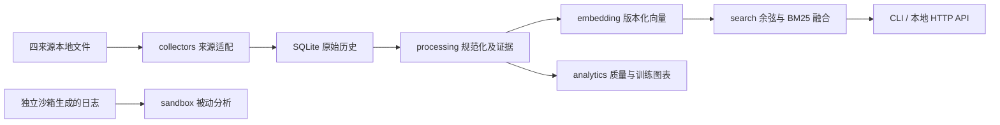

# 六工具实施计划

当前阶段：2026-09-14，独立工程迭代版。约束：本地离线链路可运行，联网采集必须显式启动，模型接口后续配置；不修改 VulnPulse。工具一、工具四和工具五的工程能力已按各自说明完成；本文是本项目实施依据，早期旧项目评估仅作参考。

## 数据流与工程结构

源码位于 `vulntools/`：models 与 storage 提供共享数据契约，其余六个工具分别实现独立模块。当前是模块化单体，尚不引入分布式队列、微服务或外部向量数据库。

记录保存来源、字段候选、冲突、证据定位、原始哈希和规范记录修订。首版字段状态为 present、missing、conflicted；unknown 与 not_applicable 的细分留待下一版。无法确定的版本判断返回 unknown，缺失字段保持 null。

## 第一阶段：离线最小闭环（本次实现）

1. 本地回放 CVE/NVD 原生 JSON，以及 AVD/CNNVD 交换文件；保留原始来源和修订历史。
2. 按 CVE 精确合并，候选字段按固定来源优先级选展示值，同时保留冲突。描述近似仅生成审核候选，不自动合并不同漏洞。
3. 提供缺失字段与定向检索计划；不使用猜测填充未知字段。
4. 实现不依赖模型下载的特征向量与 BM25/RRF 混合检索；本地模型作为可选 Provider。
5. 输出数据质量 JSON/CSV，绘制样本分布和已有训练日志曲线。
6. 沙箱先定义不可放宽的策略契约、拒绝未配置执行和被动事件分析。
7. 提供统一 CLI、任务历史与只读本地 HTTP API。

验收：模拟来源全链路可重放；重复运行幂等；检索可溯源；错误过滤不被放宽；字段修订后旧向量失效；非有限向量写入回滚；策略不合格时拒绝；全过程无外网模型依赖。

## 第二阶段：采集与多模态质量闭环（工程能力已完成）

工具一已完成CVE官方仓库基线与滚动增量、NVD修改窗口与全量分页、检查点恢复、限速重试、防旧快照覆盖、批量失败队列、AVD/CNNVD公开页及交换文件解析。CVE和NVD单条及限量增量已联网抽查；AVD/CNNVD仍受平台公开接口、登录和WAF约束，不声明绕过后可用。

- 已保留内部稳定身份、多源别名、字段来源和冲突；不同漏洞仅产生重复审核候选。
- 文本、Markdown/HTML 代码、图片引用、OCR 转录和补丁统一生成带位置与内容哈希的 Evidence；静态提取代码行为但不执行 PoC。
- 缺失字段可显式从 CVE/NVD 或用户提供的授权页模板联网补齐，限制记录数和请求数；仅完整解析的来源证据可写入，冲突进入审核。
- AVD/CNNVD 已提供配置化授权 JSON API 契约、环境变量认证和严格响应映射；正式接口地址、字段映射及生产可用性仍取决于平台授权，不假设未公开接口结构或绕过访问控制。
- 组件已按 PURL、CPE、厂商/产品名分层消歧，强标识冲突和低置信身份进入人工复核；原生图像向量以本地模型工件独立保存，不与未对齐的文本向量混用。

验收：按来源、模态分别评测抽取和补齐准确率；重复误合并与漏合并可量化；错误与缺失不会无声覆盖正确数据。

## 第三阶段：领域嵌入与检索能力（工程能力已完成）

- 已构造描述—PoC、描述—补丁、描述—组件和描述—元数据的有证据正样本，以及 CWE 不相交的候选负样本。
- 已实现固定基础编码器上的监督式领域余弦适配器，记录训练参数与损失；模型、维度和预处理不一致时拒绝使用。
- 已分别保留漏洞聚合、描述、PoC、补丁、组件和元数据视图，并提供检索、PoC 匹配、聚类、CWE 类型识别和 HTTP 接口。
- 真实效果仍需在冻结测试集上比较特征基线、本地语义模型和领域训练模型，并人工核实困难负例。
- 规模增大后接入 Qdrant 等近似索引，增加批量编码、重排与集合切换回滚。
- 版本过滤已支持 SemVer 预发布、Python/PEP 440、Maven、日期与数字区间，以及 CVE 状态变化；未知厂商规则和冲突记录仍返回 unknown。NVD CPE 2.3 条件树支持 AND、OR、negate 和版本边界，调用方必须提供完整目标 CPE 环境，缺失上下文不会猜测为受影响。

验收：Recall@K、MRR/nDCG、PoC 匹配、类别识别及分组指标可复算；在固定数据规模、硬件上记录 P95 延迟；不能把通用向量的生成成功当作领域训练完成。

## 第四阶段：训练分析与知识注入评价（工程能力已完成）

- 训练数据清单支持样本、漏洞、家族、划分、标签、模态和权重契约，并检查重复、未知引用和漏洞/家族跨划分泄漏。
- 训练日志支持 run_id、数据集/模型版本、训练/验证 loss、梯度、吞吐和资源指标，生成曲线与稳定性诊断。
- 知识注入效果日志支持原始模型、RAG、参数注入及组合方案等任意 variant，按相同种子和数据集版本与基线成对比较。
- 输出统一 JSON、审核 CSV 和质量、训练、效果、漂移图；训练日志可从单文件或追加式 JSONL 目录汇总，历史质量报告可计算分布与覆盖率漂移。真实平台专用连接器及多人交互看板作为部署集成工作保留。

工程验收：输入校验、数据泄漏、不均衡、训练异常和指标方向均由自动测试覆盖，示例报告可离线复算。效果验收仍须使用冻结真实数据、同协议对照和重复实验；日志图不是效果结论，模拟日志不能用于成果指标。

## 沙箱独立工作线（协调器已完成，执行节点待部署）

已实现 mTLS 远程 VM 协议、独立 Agent API、持久状态/审计、幂等提交、重启恢复、销毁失败隔离、短期签名证明、九项验收检查、样本/工件哈希、任务绑定、系统调用日志强制回收、工件白名单，以及确认销毁后才发布制品。未配置通过真实验收的后端时 `execution_ready=false`，且没有宿主机或容器回退。

部署顺序：专用执行节点 → 经评审并固定摘要的 Firecracker supervisor/镜像/内核 → 一次性 VM 生命周期 → 禁外网/无宿主挂载 → 外部看门狗与资源限制 → 来宾系统调用监控 → 安全工件回传 → 九项无害隔离/恢复/完整性测试 → 签名验收记录 → 受控样例验收。详见 `sandbox-deployment.md`。

实际运行仍需要提供独立执行节点、目标来宾系统、mTLS 证书和 VM agent。Windows 开发机不作为未知样例的执行环境。用户态样例与可获得来宾内核权限的样例分开定义威胁模型；对后者不能仅信任来宾日志。

## 接下来的首批任务

下一步转为真实环境验收：配置经审核的本地语义模型与人工标注集，建立冻结检索/分类测试集；取得 AVD/CNNVD 授权接口；部署独立 VM agent 并完成隔离验收。统一管理页面可复用现有 HTTP 契约，在真实指标稳定后建设。

## 技术资料

- CVE 官方下载指向 CVE List V5：[CVE Downloads](https://www.cve.org/Downloads)。
- NVD 参数与接口资料：[Vulnerabilities API](https://nvd.nist.gov/developers/vulnerabilities)。
- 本地模型编码接口：[SentenceTransformer](https://www.sbert.net/docs/package_reference/sentence_transformer/model.html)。

以上用于接口设计参考；第一阶段按离线要求验收，不代表已验证外部服务可用性。
