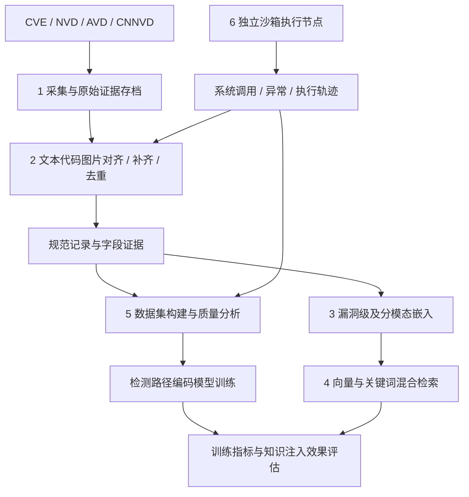

# VulnPulse 六工具架构与开发方案

评估日期：2026-09-11。范围：代码与文档静态评估，不代表采集站点、模型下载、Qdrant 服务及端到端功能已通过运行验证。本轮只新增方案文档，保留工作区已有修改。

## 1. 总体决策

在现有 VulnPulse 上扩展，形成“统一数据底座、六个独立模块、统一管理入口”。第一阶段使用模块化单体与独立任务进程，避免先拆成六套微服务。沙箱执行节点从开始就独立部署，不与采集、数据库或模型服务共用执行权限。

六项需求中，1—4 构成知识数据主链路；5 负责数据、训练和效果评估；6 提供受控执行与轨迹证据。向量表示与检测路径编码模型是两类模型，分别管理版本、训练集和评价指标。RAG 的改善也不能直接当作参数知识注入的改善。

## 2. 现有实现与差距

下表“已有”仅表示发现相关实现，不表示需求完整满足。

| 工具 | 已有基础 | 需要补齐 |
|---|---|---|
| 1 采集 | `collector/cve_feeds` 中有 NVD、CNNVD、AVD；`collector/batch_nvd.py` 有分片、校验与续采 | CVE 官方独立适配器、统一任务协议、跨平台增量水位、修订/撤回处理、逐平台可用性验证 |
| 2 处理 | `normalizer` 字段提取与证据处理，`reviewer` 审核，`canonicalizer/build_records.py` 多源规范化 | OCR/视觉信息定位、代码与补丁语义、按字段补齐闭环、无 CVE 记录实体消歧、冲突裁决与可逆合并 |
| 3 嵌入 | `search/rag/ingestion.py` 使用 FastEmbed 生成文本向量 | 中英文及代码基线对比、多视图向量、领域对比学习、模型版本和独立评测 |
| 4 检索 | Qdrant、Top-K、过滤、UUID5 增量 upsert、API/MCP、检索与详情页面 | 稀疏/稠密融合、重排、组件版本约束、分数解释、删除同步、索引版本切换 |
| 5 分析 | `training/pipeline.py` 训练样本、CVE 分组划分、质量报告；`eval` 质量评估 | 训练运行日志、loss/梯度/学习率分析、样本分布页面、知识注入对照实验 |
| 6 沙箱 | `training/trajectory.py` 被动导入轨迹 | 环境生命周期、执行控制、系统调用监控、异常捕获、资源限制与隔离验收 |

当前代码中需优先处理的具体问题：

1. `search/rag/client.py` 在带过滤检索为空时，会重试无过滤检索。应默认严格遵守过滤条件；扩大范围必须显式启用，并标注放宽了哪些条件。
2. `search/rag/ingestion.py` 将维度固定为 384，而配置允许更换模型。应由模型契约确定维度，启动时校验集合维度与模型版本，不兼容时拒绝写入。
3. 同文件默认 `replace` 会删除并重建集合。常规同步应采用增量写入；全量升级采用新集合构建、校验、切换与回滚。
4. 默认模型配置为 `BAAI/bge-small-en-v1.5`。现有代码未证明其中文、PoC 和补丁语义能力，不能作为领域嵌入已经完成的依据。
5. `agent` 审核后端在 README 中标注为契约/启发式实现；轨迹导入仅处理已有事件。这两部分不能分别等同于完整智能审核与沙箱执行。

## 3. 共享数据契约

保留现有 Qdrant `page_content / metadata / record` 外层格式，新增字段通过 schema 版本迁移。原始数据、规范记录、向量与训练样本分别存储。

| 对象 | 必备字段与含义 |
|---|---|
| RawDocument | source、source_record_id、URL、采集时间、源修订时间、内容哈希、MIME、原始文件位置、采集状态 |
| Evidence | evidence_id、document_id、模态、原文位置或图片框、提取器版本、原文/提取内容、置信度 |
| CanonicalVulnerability | 内部稳定 vuln_id、aliases、描述、产品与版本约束、CWE、攻击前提、利用方式、PoC、补丁、风险、字段证据、冲突、记录版本 |
| EmbeddingArtifact | vuln_id、record_revision、输入哈希、模型与版本、预处理版本、维度、向量视图、生成时间 |
| SearchHit | vuln_id、各路召回分数、融合/重排分数、命中字段、证据引用、过滤条件、索引与模型版本 |
| TrainingRun | run_id、数据集哈希、划分版本、模型版本、配置、随机种子、逐步指标、评测结果 |
| SandboxRun | run_id、样本哈希、环境镜像哈希、策略版本、状态、退出原因、事件日志、工件哈希 |

字段值至少区分 present、missing、unknown、not_applicable、conflicted。不能把“未找到 PoC”直接写成“没有 PoC”，不能把不同版本 CVSS 或不同日期 EPSS 覆盖为一个无时间信息的值。

无 CVE 的漏洞使用内部 ID；后续发现 CVE 时建立别名映射，保持历史链接。每个字段保留来源和变更记录，合并必须可撤销。

## 4. 六个模块的设计与验收

### 4.1 漏洞元数据采集

适配器统一提供发现更新、获取记录、解析记录三个能力；输出 RawDocument 和来源级结构化事实，不直接覆盖规范记录。任务支持分页、限速、重试、检查点与失败队列；增量窗口适当重叠，通过来源 ID 和内容哈希去重。

CVE 与 NVD 分开接入：前者保存 CVE 原始记录，后者提供自己的分析与补充信息。CVE 官方下载页指向 cvelistV5 批量数据，可作为新增适配器的数据入口：[CVE Downloads](https://www.cve.org/Downloads)。AVD/CNNVD 现有抓取逻辑须分别验证当前可用性，失败记录为来源错误，不作为空漏洞数据覆盖。

验收：四个平台分别具备固定样本回放和联网冒烟测试；中断后续采不重复；源数据更新、撤回和请求失败有正确状态；每条规范记录可追溯原始材料。

### 4.2 多模态处理、补齐与去重

文本提取段落与结构；代码保留语言、代码块、关键调用与静态行为摘要；补丁保留修改前后差异和安全检查变化；图片使用 OCR/视觉模型提取信息，同时保存图片位置和置信度。文本化只是初始统一表示，不等于已经具备原生图像语义向量。

处理流程为：解析 → 字段提取 → 校验 → 缺失发现 → 定向搜索 → 证据提取 → 冲突裁决 → 规范化。补齐设置每记录请求数、费用与时间预算；优先查询原始公告和厂商资料。搜索摘要仅作为定位线索，无证据时保留 unknown。网页和代码内容不能成为执行指令。

去重先检查 CVE/CNNVD/AVD 别名，再用产品、版本、引用、补丁及描述寻找候选；语义相似仅用于候选发现。不同编号不自动视为同一漏洞，冲突进入审核队列。

验收：人工标注集覆盖文本、代码、图片与冲突案例；报告字段准确率、补齐准确率、证据覆盖率、错误合并率和遗漏合并率，按模态分别统计。

### 4.3 漏洞元数据嵌入

先建立冻结模型基线，再开展领域训练。保留漏洞级聚合向量，同时提供描述、PoC 行为、补丁等视图。图片首期通过带定位的提取内容参与表示，后续以实验决定是否增加视觉编码器。

领域训练使用有证据关联的描述—PoC、描述—补丁等正样本，以“同产品但根因不同”等已审核样本构造困难负例；不能仅凭编号不同就标为负例。跨模态对齐、漏洞类型和风险预测可作为辅助任务，需通过消融验证价值。

模型记录维度、距离度量、归一化方法和输入截断策略。模型改变时新建索引版本；查询编码器与库中向量必须版本兼容。

验收：固定测试集比较通用基线与领域模型的 Recall@K、MRR/nDCG、PoC 匹配和类型识别；聚类结合人工检查及有标签指标；按中文、代码长度和漏洞类别分组报告。不得将“能生成向量”当作“学到了深层语义关联”。

### 4.4 向量检索

查询支持文本、PoC、组件名与版本。先解析精确 ID 和结构化约束，再进行稠密与关键词/稀疏召回，融合后重排；组件版本通过生态对应的版本规则比较，不通过向量相似度判定是否受影响。版本缺失返回未知匹配状态。

Qdrant 官方已提供混合与多阶段查询能力，可在现有基础上扩展：[Hybrid Queries](https://qdrant.tech/documentation/search/hybrid-queries/)。

增量索引以记录修订与输入哈希判断是否重新嵌入，支持幂等更新、撤回删除、失败补偿与版本切换。结果展示来源、证据片段、匹配字段、版本判断、各阶段分数；分数解释不作为因果证明。

验收：建立文本、代码、产品版本三类查询集；统计 Recall@K、nDCG@K、P95 延迟、索引体积及更新延迟。功能门槛包括过滤不被静默放宽、撤回记录不再命中、重复写入不产生重复结果。性能阈值在固定硬件和数据规模上测量后确定。

### 4.5 数据分析与可视化

数据层展示来源、年份、CWE、风险、组件、模态、字段缺失、重复、冲突与样本长度分布。训练层接入真实日志，展示训练/验证 loss、学习率、梯度范数、吞吐、显存、NaN 和异常中断；尚未接入训练时明确显示无数据。

效果层至少比较：原始模型、仅 RAG、仅参数知识注入、知识注入加 RAG。在相同测试集与评测协议下比较检测路径质量、有效步骤比例、任务成功率、误报和证据支持率；存在随机性时重复运行并报告波动。

现有 CVE 分组划分继续保留，并增加漏洞家族/补丁重复检查及时间留出集，避免同类近重复跨训练和测试集合泄漏。测试集冻结，不参与困难负例挖掘或调参。

验收：报表可回查样本与 run_id；指标可由保存日志重算；缺失日志、异常梯度和分布偏差可被识别；效果结论对应明确实验配置。检测路径的步骤定义、标注规范和成功标准需在训练阶段开始前落实。

### 4.6 沙箱受控部署

采用独立执行节点和一次性虚拟机边界。Windows 工作站负责开发与控制；Linux 专用节点评估 KVM/microVM 路线，Windows 测试用例使用对应 Windows 虚拟机路线。Firecracker 方案依赖 Linux/KVM 与相应宿主配置，部署应参考其 [入门说明](https://github.com/firecracker-microvm/firecracker/blob/main/docs/getting-started.md) 和 [生产宿主配置](https://github.com/firecracker-microvm/firecracker/blob/main/docs/prod-host-setup.md)。

执行环境默认关闭外网，仅允许明确配置的实验网络；禁止宿主目录、设备和凭据进入来宾。使用只读基础镜像、临时写入层、CPU/内存/磁盘/进程/时长限制，以及外部看门狗。完成或失败后销毁环境，经受控导出通道保存日志和工件。

监控必须区分来宾测试程序的系统调用与宿主虚拟机进程的系统调用。用户态 Linux 样例先实现来宾侧进程树跟踪，捕获 syscall、返回值、信号、退出码、超时/OOM、文件与网络行为；需要更高覆盖率时验证审计或 eBPF 方案。来宾获得内核权限后，来宾日志不再是独立可信证据，此类样例需单独威胁模型与更强外部观测。

“完全受控”转化为可测试边界，不能承诺虚拟化零逃逸。第一期用无害的越界访问、受限联网、超时和资源耗尽测试验证策略，不直接执行未知恶意代码。

验收：网络限制、文件边界、进程树终止、资源限制、日志采集、工件导出与销毁逐项验证；策略和监控启动失败时拒绝执行，控制端失联后外部看门狗仍能终止任务。

## 5. 模块接口与工程组织

保留 `collector`、`normalizer`、`reviewer`、`canonicalizer`、`search/rag`、`training`、`eval` 与现有前端；新增 `embedding`、`analytics`、`sandbox`，补齐 `models` 的共享契约。不要仅因目录已存在就认定功能已实现。

建议任务型 API：采集、处理、嵌入、索引、训练日志导入和沙箱运行返回 job_id；查询任务接口返回状态、进度、错误、产物与版本。搜索 API 独立接受 query_text、poc_code、component、version、filters、top_k，并返回 SearchHit。

统一任务状态：queued → running → succeeded / failed / cancelled；待审证据单独标识 needs_review。每次运行保存输入哈希、代码与配置版本、开始结束时间、重试记录。研究期使用现有文件产物和 SQLite 任务状态；有并发与部署需求后再迁移共享数据库和对象存储。

## 6. 分阶段实施顺序

以下工作量为单名熟悉项目开发者的初步估算，不含标注、硬件采购、外部平台等待和模型训练实验耗时；应在第一阶段结束后修订。

| 阶段 | 工作与交付 | 退出条件 | 估算 |
|---|---|---|---|
| P0 基线与契约 | 运行现有测试、检查依赖和采集可用性；冻结记录/证据/模型契约；处理过滤、维度和索引重建问题 | 现有能力实测清单、可回放样本、契约与迁移方案 | 2—4 人日 |
| P1 最小闭环 | CVE 官方接入，统一四源任务；文本规范化；基础嵌入、索引与来源展示 | 固定样本从原始材料到可溯源检索结果贯通，可重跑与续采 | 5—8 人日 |
| P2 多模态与质量 | OCR、代码/补丁证据、字段补齐、去重冲突与质量报告 | 标注集评测完成，自动补齐和自动合并边界确定 | 8—12 人日 |
| P3 检索与嵌入 | 多视图、混合召回、版本过滤、重排、领域训练基线与对照 | 检索指标、延迟和领域模型对比报告可复现 | 8—15 人日 |
| P4 训练分析 | 真实训练日志、质量页面、知识注入对照与消融 | 数据—训练—效果三层分析贯通 | 5—8 人日 |
| S 沙箱独立线 | 威胁模型、环境节点、无害验收、监控、轨迹与工件回传 | 隔离与生命周期测试通过后接入受控样例 | 8—15 人日 |

沙箱设计可在 P0 开始；若只有一名开发者，表中各线不意味着能够同时完成。执行轨迹参与训练的实验必须等待沙箱验收，P1—P3 的静态数据链路不必等待沙箱实现。

今天的首批开发任务建议：建立来源样本夹具与基线测试记录；定义 CanonicalVulnerability/Evidence/EmbeddingArtifact；修复严格过滤和维度契约；新增 CVE 官方适配器；选取覆盖四来源、无 CVE、冲突和修订场景的小批样本打通链路。优先以数据和证据闭环作为首个可演示成果。

## 7. 后续需要落实的输入

实施前逐阶段明确：目标记录数与每日增量、允许的联网模型及预算、训练硬件、检测路径编码模型与标签定义、目标操作系统与可提供的隔离节点。这些信息影响性能指标、模型选择和沙箱实现，不影响本轮确定模块边界和启动 P0。
